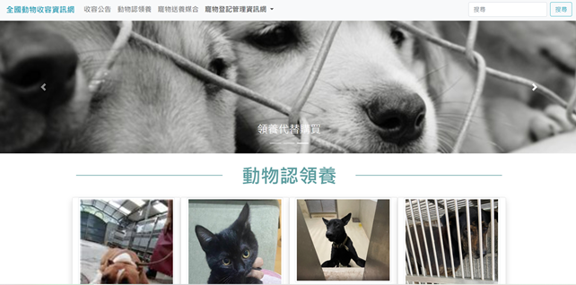
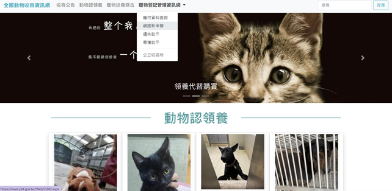
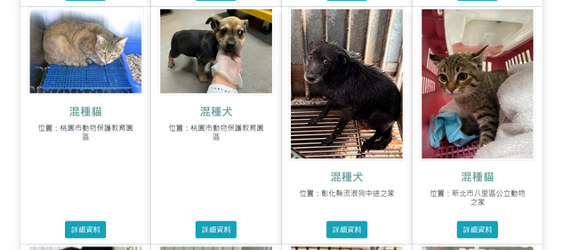
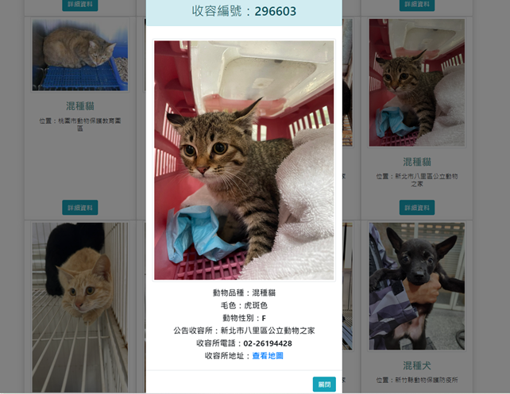
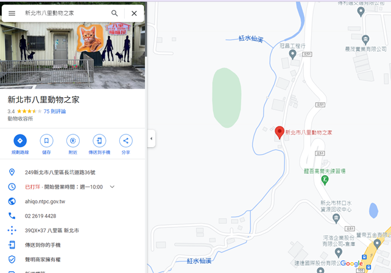

# <p align="center">Web-API-Adoption</p> 
### 響應式網頁設計與Web API實作內容：  
```
1. 以Ajax介接Web API讀取全國動物收容資訊網最新的20筆資料。  
2. 運用到Grid System、NavBar、DropDown、Carousel、Card、Modal、Alert等Boostrap元件，做出響應式效果。
```
### 成品畫面：  
  
      
   
      
  
      
    
    
    
    
